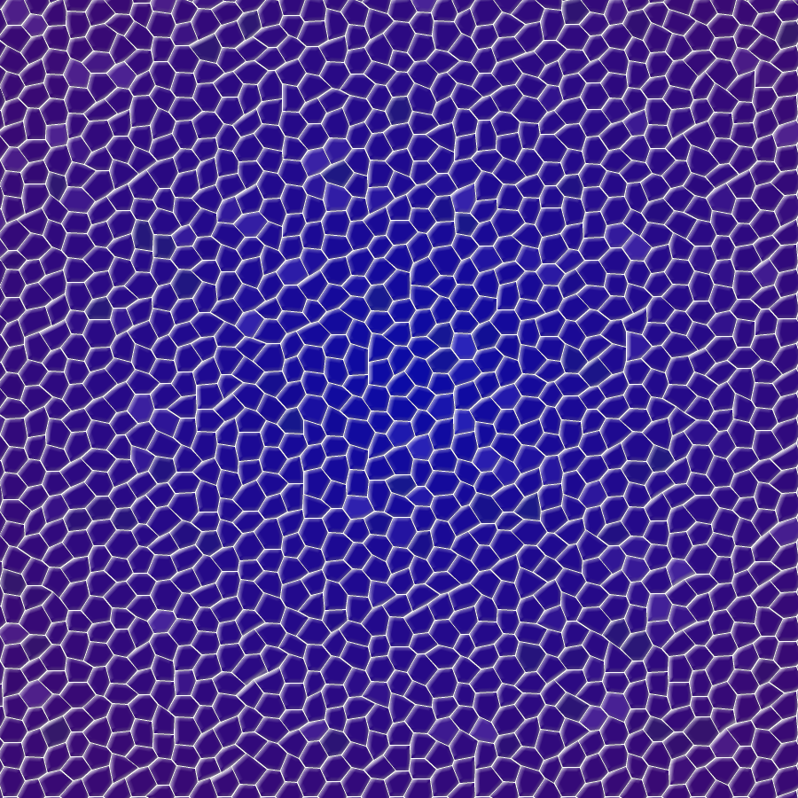

# Yamlomiser
Yamlomiser (YAML + Randomiser) is small software I've built inspired by conversation
about usage of AI to generate names. However, as much as it could lift such weight
from your shoulders, AI will not achieve coherency with your created world easily, and
generated names will most probably be extremely generic.

Hence, Yamlomiser puts this weight back on your shoulders. Don't thank me!

# What is it
Yamlomiser uses .yaml file to randomise values you manually put into it, supporting
also separation through categories.  
It is meant to be helper with anything that requires some randomness with controlled coherency - for example,
searching for name of your character, but from collection of names you want. Categories allow you
to make it a bit more customised, for example have names and surnames, or categories for gender, culture or
whatever else.

# How it works
Yamlomiser works with .yaml file, namely `values.yaml`. If you want small explanation
of YAML syntax, head [here](https://docs.ansible.com/ansible/latest/reference_appendices/YAMLSyntax.html),
however it is so intuitive that it should be enough for you to just take a peek into
the file to see how it works. You can open it with any text reading software, like Notepad.  
File needs to have at least one category and one value.

Currently, there is no executable file, as for some reason [Ocra doesn't build proper executable files](https://github.com/larsch/ocra/issues/183)
and I am struggling from the same issue. So, you will need to take some additional steps to run the file:
- [Download and install Ruby](https://rubyinstaller.org/downloads/) (3.2.1 version is suggested)
- Once installed, use `gem install yaml` command in [PowerShell](https://www.guru99.com/powershell-tutorial.html) (also known as `cmd`)
- Run the file by either double-clicking **randomiser.rb** file, or through PowerShell command `ruby [path_to_the_file]` (if you run it from the folder the file is in, it's simply `ruby randomiser.rb`)

You can try to build the executable yourself, for it simply run **build.rb** file (or `ruby build.rb` for PowerShell command).   
Building executable additionally requires `ocra` and `zip` gems (and possibly `rubyzip` as well). Be aware it may not work, as it didn't for me.

# License and credits
License: simple [**All Rights Reserved**](license.md). Because why the heck not.
Credits:
- Toma400 (code, logo, everything)
- GothRoss server (idea)

Also, \#NoAI & \#SupportHumanArtists, everyone!
